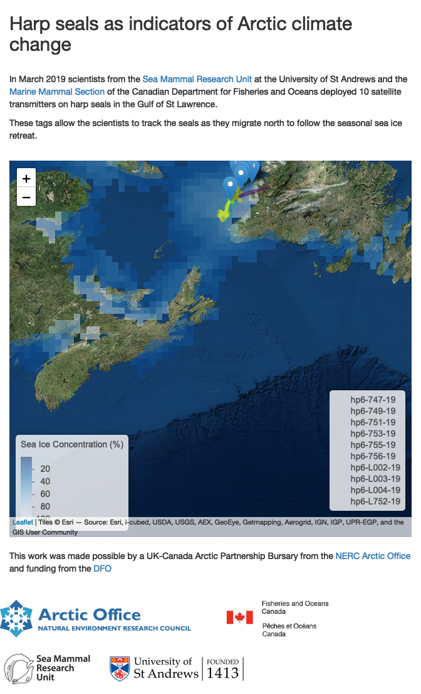

<!-- README.md is generated from README.Rmd. Please edit that file -->
[](https://www.repostatus.org/#active)

harpMap
=======

**harpMap** is a shiny app based around `leaflet` that visualises harp seal telemetry data

``` r
knitr::include_app("https://jamesgrecian.shinyapps.io/harpmap/", height = "400px")
```

[](https://jamesgrecian.shinyapps.io/harpmap/)
